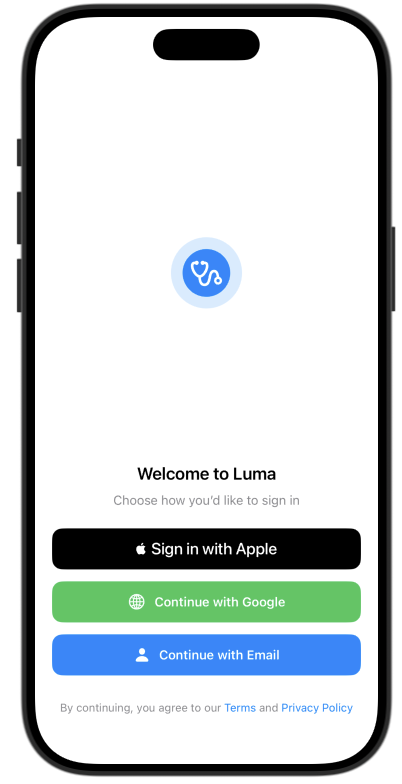
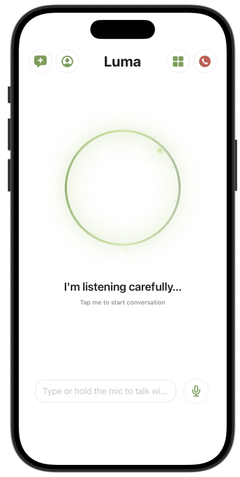
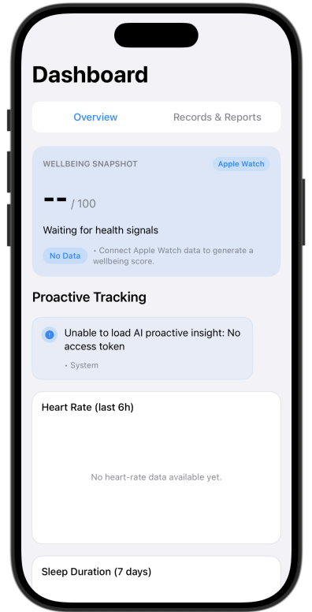
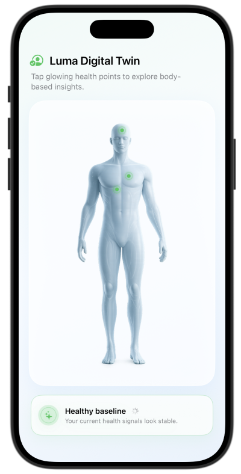

# Luma – Project Handover Document
**ANU TechLauncher 2026 | Team 6 – Luma**
**AI Mental Health Support Companion**
**Stakeholder: Jerome Loo | Tutor: Yumin**

---

## Team

| Name | Student ID 
|---|---|
| Jyothi Kalaichelvan | u8010086 | 
| Chenjun Liao | u7915984 |
| Jiaoyang Liu | u7976905 | 
| Ke Li | u8006266 |
| Xinao Qiao | u7873870 | 
| Qiyuan Han | u7975384 |

---

## 1. Project Overview

Luma is an AI-powered mental health support companion built as an iOS MVP. It integrates real-time Apple Watch biometric data, a Django/Supabase backend, and the Claude (Anthropic) API to deliver personalised wellbeing insights through an interactive dashboard and conversational AI companion interface.

**Tech Stack:** SwiftUI (iOS) · Django (Backend) · Supabase (PostgreSQL + Auth) · Claude API (Anthropic) · Render (Cloud Deployment) · Apple HealthKit (Watch Integration)

**Live Backend:** `https://luma-backend-9mz4.onrender.com`

**Repository:** 

---

## 2. How to Run the App (For Demo)

### Prerequisites
- Xcode 14.0+ on macOS 12.0+
- iOS 15.0+ device or simulator
- Apple Watch paired (for biometric sync)
- Backend already deployed on Render — no local backend setup needed for demo.

### Steps
1. Clone the repository: `https://github.com/QiyuanHananu/Luma-Frontend`
2. Open `Luma.xcodeproj` in Xcode
3. Select your target device (physical iPhone recommended)
4.
5. Press **⌘+R** to build and run
6. Complete onboarding on first launch

> **Note:** Backend is hosted on Render's free tier. The first API call after inactivity may take 5–10 seconds (cold start). Subsequent calls are normal speed.

---

## 3. Delivery Plan Checklist

> This section maps every item in the delivery plan (Sections 1.1, 1.2, 2.4) to its implementation evidence. Use this as the walkthrough reference.

---

### 3.1 Must-Complete Items (Delivery Plan §1.2)

#### Core Prototype Workflow

- [x] **SwiftUI frontend with dashboard views**
  - Code: `https://github.com/QiyuanHananu/Luma-Frontend/blob/main/Luma/Views/DashboardRedesign.swift`
  - Demo: Run app → Tab 1 (AI Companion) → ☰ menu → Medical Dashboard

- [x] **Django + Supabase backend integration**
  - Code: `https://github.com/jo355/Luma-backend`
  - Live endpoint: `https://luma-backend-9mz4.onrender.com/test`

- [x] **AI Companion interface**
  - Code: `https://github.com/QiyuanHananu/Luma-Frontend/blob/main/Luma/Views/CompanionView.swift`
  - Demo: Run app → Tab 1 → Tap Luma → Send a message → Receive AI response

- [x] **Proactive insights generated from biometric data**
  - Code: `https://github.com/QiyuanHananu/Luma-Frontend/blob/main/Luma/Views/DashboardRedesign.swift`
  - Demo: ☰ menu → Medical Dashboard → Insights panel

- [x] **Digital Twin biometric data workflow**
  - Code: `https://github.com/QiyuanHananu/Luma-Frontend/blob/main/Luma/Views/DigitalTwinPage.swift`
  - Demo: Run app → 3D model renders → Tap head (Brain Health) / Tap chest (Heart Health)

- [x] **Apple Watch biometric sync to backend**
  - Code: `https://github.com/QiyuanHananu/Luma-Frontend/blob/main/Luma/Views/SleepHealthView.swift`
  - Demo: Sync Watch → data appears in Supabase → dashboard updates

- [x] **End-to-end integration (Watch → Backend → AI → Dashboard)**
  - Evidence: See Testing Report (Section 5 of this document)
  - Demo: Full live walkthrough during presentation

---

### 3.2 Handover Documents (Delivery Plan §2.4)

- [x] **Technical Architecture Document**
  - Link: `https://drive.google.com/file/d/1DTLSt6KkS4rjxkP-ULD8e7CsT7dPWYmo/view?usp=drive_link`
  - Contents: System architecture diagrams, SwiftUI frontend structure, Django backend services, Supabase integration, AI workflow, biometric data pipeline

- [x] **Deployment & Setup Guide**
  - Link: `https://drive.google.com/file/d/1iTRRfVpNIu_n6t2AOnb4bTEu7sQAENFB/view?usp=drive_link`
  - Contents: Environment setup, Xcode build steps, backend deployment on Render, Supabase configuration, API key setup, Apple HealthKit permissions

- [x] **API Documentation**
  - Link: `https://drive.google.com/file/d/1E8uFuVR6nnu0IhW_wm1bwOLtQg1SYljk/view?usp=drive_link`
  - Contents: All backend endpoints, request/response formats, authentication flows, biometric data endpoints, chatbot API, Supabase communication

- [x] **Database Schema Documentation**
  - Link: `https://drive.google.com/file/d/1uZHiwp7N1_EJYUBDjMtvktPWNboElXWv/view?usp=drive_link`
  - Contents: ER diagrams, table definitions, attribute descriptions, biometric and sleep data structures
  - Screenshot: `[INSERT SUPABASE SCHEMA SCREENSHOT HERE]`

- [x] **AI System Documentation**
  - Link: `https://drive.google.com/file/d/14mh_NU5LZMmdNgRWWDxmX7lQfJca8NGe/view?usp=drive_link`
  - Contents: Claude API integration, prompt workflow, chatbot-to-database logic, contextual insight generation, current AI limitations

- [x] **User Guide**
  - Link: `https://drive.google.com/file/d/1WM5EM5bte5YeCXUANFaB67Otu3xizgkE/view?usp=drive_link`
  - Contents: Onboarding, Apple Watch connectivity, dashboard navigation, AI Companion interaction, report viewing

- [x] **Testing Report**
  - Link: `https://drive.google.com/file/d/1EU7leIiOnKEy2EZRp0kUoS5-76MXrgIK/view?usp=drive_link`
  - Contents: 31 test cases across frontend, backend, AI, Watch integration, dashboard, privacy — all passed. Known issues documented.

- [x] **Known Limitations & Future Recommendations**
  - Link: `https://drive.google.com/file/d/1LeM8XVTZviHVP4uh7oTah9niYrttz-9S/view?usp=drive_link`
  - Contents: Current prototype limitations, unresolved low-priority issues, future development roadmap

- [x] **Delivery Plan**
  - Link: `https://drive.google.com/file/d/1HS9Oy4VGT7FU6i8nqySIRc-F3rX7gE4Y/view?usp=drive_link`

---

### 3.3 Core System Components (Delivery Plan §3.1)

#### Dashboard & Analytics System (SwiftUI + Supabase + Django)
- Status: **Completed**
- Demo: ☰ menu → Medical Dashboard → health metrics, trends, insights
- Code: `https://github.com/QiyuanHananu/Luma-Frontend/blob/main/Luma/Views/DashboardRedesign.swift`

#### AI Companion System (Claude API + Database Integration)
- Status: **Completed**
- Demo: Tab 1 → chat with Luma → contextual response using biometric data
- Code: `https://github.com/QiyuanHananu/Luma-Frontend/blob/main/Luma/Views/CompanionView.swift`

#### Digital Twin (Apple Watch + Biometric Pipeline)
- Status: **Completed**
- Demo: Watch sync → data stored in Supabase → displayed in dashboard and Digital Twin view
- Code: `https://github.com/QiyuanHananu/Luma-Frontend/blob/main/Luma/Views/DigitalTwinPage.swift`

---

## 4. Repository Structure

```
Luma/
├── Luma/
│   ├── LumaApp.swift                        # App entry point
│   ├── AppEntryView.swift                   # Onboarding routing logic
│   ├── ContentView.swift                    # Main TabView navigation
│   ├── Views/
│   │   ├── CompanionView.swift              # AI Companion main screen
│   │   ├── DigitalTwinPage.swift            # 3D Digital Twin page
│   │   ├── HumanModelView.swift             # 3D model + hotspot interactions
│   │   ├── SimpleMedicalDashboardView.swift # Health dashboard
│   │   ├── BrainHealthView.swift            # Brain health metrics
│   │   ├── HeartHealthView.swift            # Heart health metrics
│   │   ├── SettingsView.swift               # Settings & privacy
│   │   └── OnboardingView.swift             # First-launch onboarding
│   └── Models/
│       └── UIModels.swift                   # Data models
├── LumaTests/
│   ├── LumaTests.swift
│   └── TestAPI.swift                        # Backend API connectivity test
├── LumaUITests/
│   ├── LumaUITests.swift
│   └── LumaUITestsLaunchTests.swift
├── backend/                                 # [INSERT LINK TO BACKEND FOLDER]
│   └── [Django services, Supabase integration, API endpoints]
├── docs/                                    # [INSERT LINK TO DOCS FOLDER]
│   ├── Technical_Architecture_Document.[ext]
│   ├── Deployment_Setup_Guide.[ext]
│   ├── API_Documentation.[ext]
│   ├── Database_Schema_Documentation.[ext]
│   ├── AI_System_Documentation.[ext]
│   ├── User_Guide.[ext]
│   ├── Testing_Report.md
│   └── Known_Limitations_Future_Recommendations.[ext]
└── HANDOVER_README.md                       # This document
```

---

## 5. Testing Summary

Full testing report: `[INSERT LINK TO Luma_Testing_Report.md]`

| Area | Tests | Status |
|---|---|---|
| App Launch & Onboarding | 3 | ✅ All Pass |
| iOS Frontend Navigation | 9 | ✅ All Pass |
| Backend API & Cloud Deployment | 5 | ✅ All Pass |
| Apple Watch & Biometric Pipeline | 3 | ✅ All Pass |
| AI Companion (Claude API) | 4 | ✅ All Pass |
| Dashboard & Health Reports | 4 | ✅ All Pass |
| Privacy & Data Management | 3 | ✅ All Pass |
| End-to-End Integration | 2 | ✅ All Pass |
| **Total** | **33** | **✅ All Pass** |

---

## 6. Known Limitations

Current delivery scope: Luma is a functional MVP prototype intended for stakeholder demonstration and concept validation — not a production-ready medical or commercial system. It runs in a configured development environment requiring Xcode, a physical iPhone, backend service availability, and Supabase configuration.
Prototype Boundaries
Authentication — Login works via pre-configured Supabase test accounts only. Public registration, password reset, profile management, and role-based access control are not yet implemented.
Digital Twin & Biometrics — Currently displays Heart Rate, HRV, and Sleep data from Apple Watch/HealthKit. Steps, Blood Oxygen, Calories, and complex activity/recovery patterns are not yet included. Data synchronisation should be understood as prototype-level input support, not continuous production-grade wearable sync.
Dashboard & Wellbeing Score — Displays wellbeing snapshot, trend charts, and proactive tracking. The wellbeing score is a prototype indicator only — it should not be interpreted as a medical risk score or clinical diagnosis.
AI Chat — Supports wellbeing-related conversation via the Claude API. Positioned as supportive wellbeing interaction, not medical advice, clinical diagnosis, or emergency support. Long-term chat memory and personalised wellbeing profiles are not yet implemented.
Proactive Tracking — AI-generated insights appear on the Dashboard as a prototype feature. A full proactive alert ecosystem with notifications, scheduled check-ins, and abnormal trend detection is a future recommendation.
Records & Report Generation — Records and Reports are included as interface and workflow demonstrations of the intended future direction. Real file upload, persistent storage, and a complete data-driven report engine are not yet implemented.
Backend & Database — Supports the core demo workflow. Production-level optimisations including rate limiting, secret management, database indexing, and query performance are future work.
Testing Scope — Current testing validates the core demo workflow. Automated backend tests, iOS UI tests, HealthKit mock tests, multi-user tests, and security/privacy testing are future recommendations.
Privacy & Compliance — Luma does not provide medical diagnosis, treatment advice, or clinical decision support. Australian Privacy Act and GDPR compliance preparation is a future recommendation.

## 7. Future Recommendations
Full document: [INSERT LINK TO Known_Limitations_Future_Recommendations.pdf]
High Priority

Digital Twin biometric sync — improve Apple Watch/HealthKit synchronisation stability, expand supported indicators, distinguish between live/cached/fallback data
AI Chat context & safety — stronger connection between AI Chat and Dashboard/Digital Twin data, long-term chat memory, health-sensitive response safeguards
Records & Report Generation — real file upload, persistent storage, integration of Dashboard + Digital Twin + AI Chat summaries into an exportable PDF report
Error handling & user feedback — clearer error messages, retry buttons, HealthKit permission guidance, backend/AI service fallback messages

Medium Priority

Standardise backend data structure and Django/Supabase responsibility boundaries
Improve Dashboard explanation capability (metric explanations, data source labels, baseline comparisons)
Increase automated testing coverage (backend unit tests, API integration tests, iOS UI tests)

Long-term

Production-ready deployment via TestFlight, CI/CD pipeline, monitoring and logging
Privacy and compliance preparation (user consent, data export/deletion, Australian Privacy Act, GDPR)
Predictive wellbeing analytics (stress trend analysis, sleep recovery prediction, long-term wellbeing trajectory)


---

## 8. Acknowledgements

We thank Jerome Loo (stakeholder) for his guidance and vision throughout the project, and the ANU TechLauncher course team and our tutor Yumin for their support and feedback across the semester.

## 9. Appendix

<table>
  <tr>
    <td align="center">
      <br>
      <strong>Figure 1. Login Screen</strong>
    </td>
    <td align="center">
      <br>
      <strong>Figure 2. AI Companion Chat</strong>
    </td>
    <td align="center">
      <br>
      <strong>Figure 3. Health Dashboard</strong>
    </td>
        <td align="center">
      <br>
      <strong>Figure 4. Digital Twin</strong>
    </td>
  </tr>
</table>

---

*Project Luma | ANU TechLauncher 2026 | Team 6*
*Last updated: May 2026*
